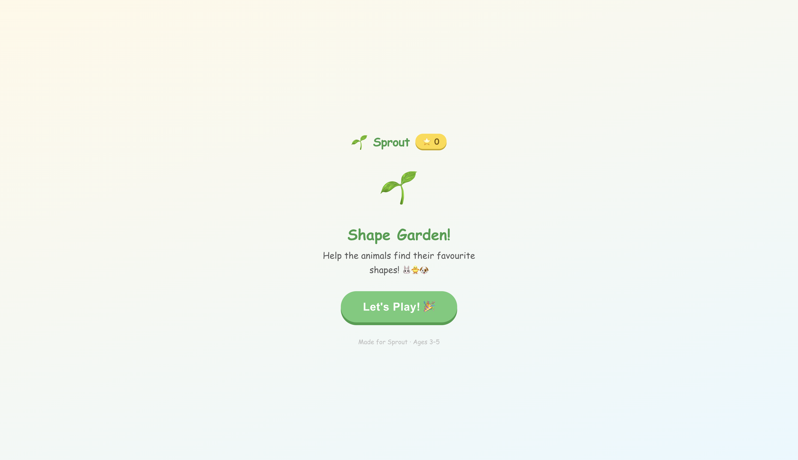
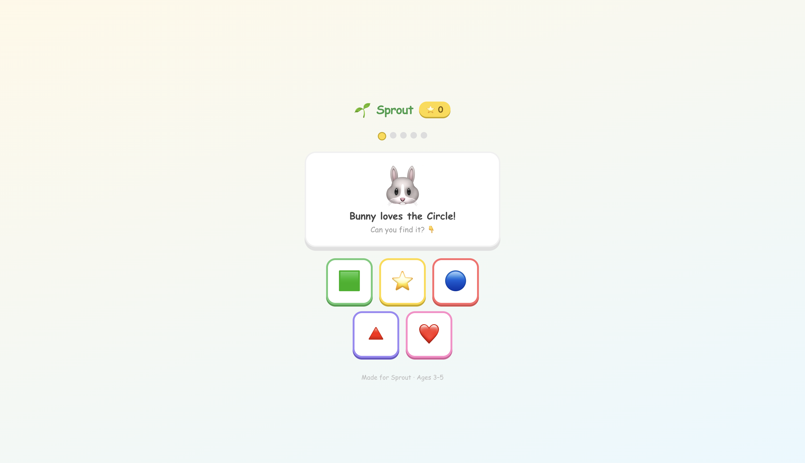
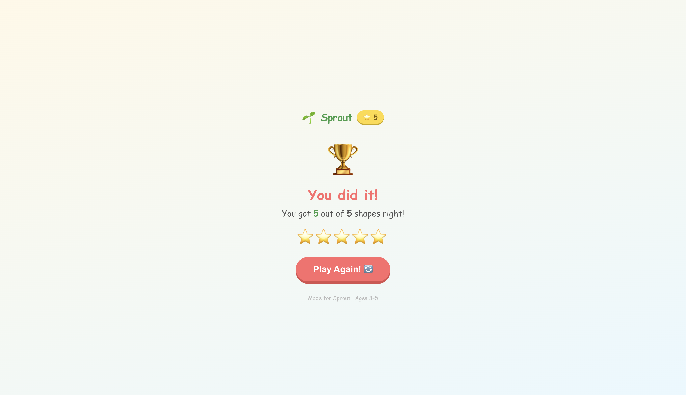

# sprout-game 🌱
A small shape-matching game I built for kids around 3–5 years old.

Sprout Game is a small JavaScript-based shape learning game designed around quick interaction and playful exploration.

The game gives players simple shape-based missions and encourages observation, recognition, and interaction through a lightweight and colorful interface.

Unlike traditional quiz-style learning apps, Sprout Game focuses more on fast gameplay and simple visual engagement.


# Features

* Shape-based gameplay
* Interactive missions
* Child-friendly UI
* Lightweight JavaScript implementation
* Quick restart and replay flow
* Simple and colorful design
* Responsive gameplay layout


# Screenshots

## Home Screen



## Gameplay



## Completion Screen



> Note: Screenshots may vary slightly across devices and browsers.


## Tech Stack

- React
- JavaScript
- HTML
- Web Audio API
- CSS animations
- GitHub Pages

# Project Structure

```txt
src/
assets/
screenshots/
```

## What's the idea

Each round a different animal shows up and it "loves" one particular shape. The child has to find it from a shuffled grid of 5. Tap the right one — stars fly, the animal bounces, a little sound plays. Tap the wrong one — the button shakes a bit, try again, no score penalty.

5 rounds total. Score screen at the end with a play again button.

## Why I built it this way

Kept it to a single screen on purpose. No routing, no state library, nothing extra. Sounds use the Web Audio API so there's no audio file to load — just generates a tone on the fly. Animations are all CSS keyframes.

Wanted it to feel snappy even on a mid-range Android, so nothing is blocking the main thread.


# Challenges Faced

One of the main challenges during development was balancing simplicity with interaction quality.

Designing gameplay that feels engaging without making the interface cluttered required multiple UI adjustments and gameplay iterations.

Another challenge was keeping the project lightweight while maintaining responsive interaction across different screen sizes.


# Future Improvements

Some ideas planned for future versions:

* More shape categories
* Sound effects
* Timed missions
* Difficulty levels
* Animations and transitions
* Score saving system
* Better mobile responsiveness


# Getting Started

## Clone the repository

```bash
git clone https://github.com/SWATANTRA-SRIVASTAV/sprout-game.git
```

## Move into project folder

```bash
cd sprout-game
```


## Run locally

```bash
npm install
npm start
```

## Live

https://swatantra-srivastav.github.io/sprout-game/


# Author

Swatantra Srivastav

Built as part of a mobile app development assignment focused on creating an engaging learning experience for children.